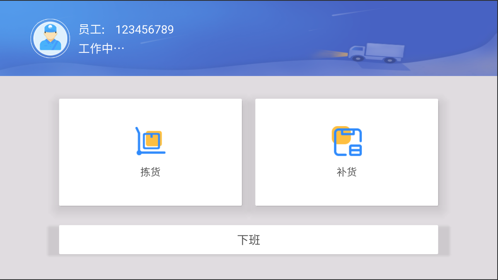
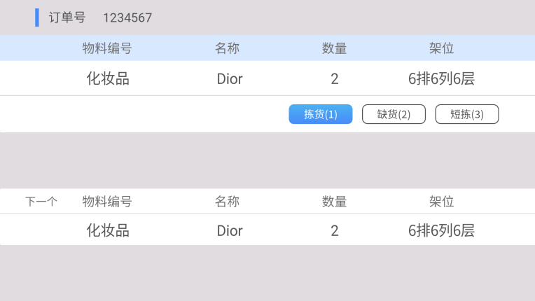
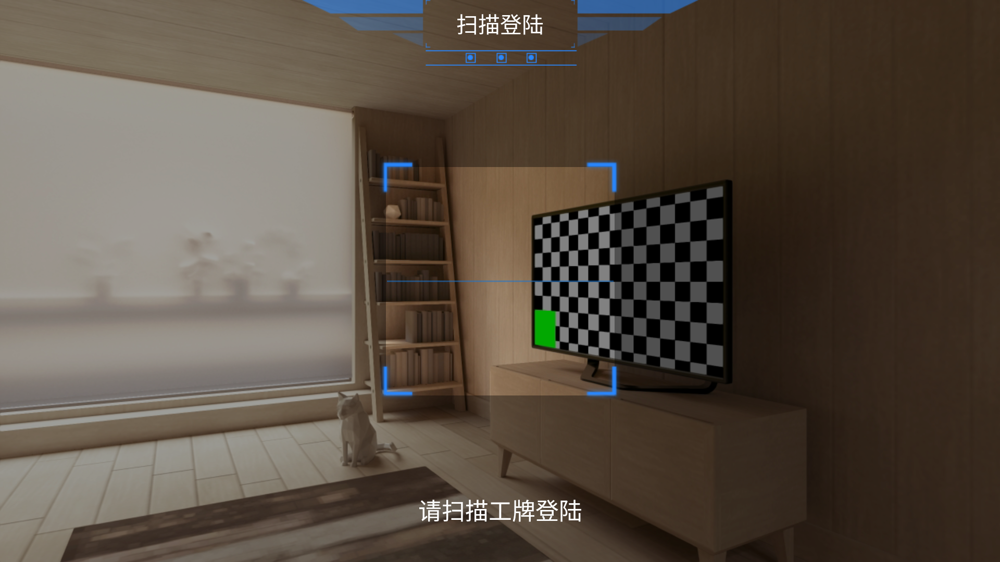

# Warehouse Picking
## Aug, 2019

Runs on Android Smart glasses free warehouse pickers' hands. Written with Kotlin and AndroidX.

Home Screen

The app showing list of items waiting to be picked, list update each time when an item is picked.

Customized QRCode scanner screen
